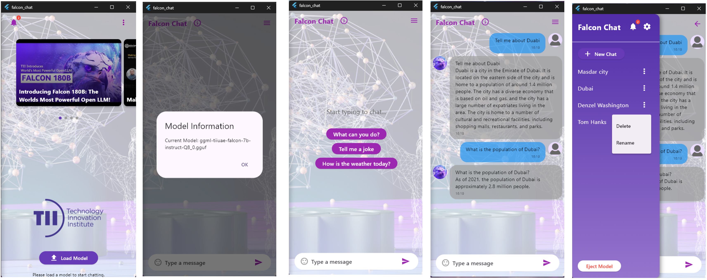

# Falcon Chat App

**Falcon Chat** is a Flutter-based application that allows users to interact with AI models (such as Falcon LLM) locally on their devices. The app features a chat interface, YouTube video integration for relevant AI content, and chat history management. Users can load a Falcon model and interact with it through a chatbot.

## Table of Contents
- [Overview](#overview)
- [Features](#features)
- [Installation](#installation)
- [How to Run](#how-to-run)
- [File Structure](#file-structure)
- [Usage](#usage)
- [Model Integration](#model-integration)
- [Chat History](#chat-history)
- [Notifications](#notifications)
- [Contributing](#contributing)
- [License](#license)

Here are some screenshots of the Falcon Chat app in action:

- *Landing page with model loading screen and update feed*
- *Homepage with hint conversations*
- *Main chat interface*
- *Chat history management, Model ejection, and settings*

## Overview

The Falcon Chat app provides users with the ability to load a Falcon LLM model locally, communicate with it via chat, view relevant video content about AI and Falcon, and save chat history for future reference. It’s built using **Flutter**, and the user interface is optimized for both mobile and desktop platforms.

## Features

- Load AI models from local files (`.gguf` format).
- Chat with Falcon LLM and view dynamic responses.
- YouTube video feed with AI-related content.
- Chat history management: save, rename, and delete chats.
- Simple and intuitive user interface.
- Notification system for latest posts related to AI models.

## Installation

### Prerequisites

- **Flutter**: Install the latest version of Flutter by following the [official guide](https://flutter.dev/docs/get-started/install).
- **Dart SDK**: Installed along with Flutter.
- **Git**: To clone the repository.
- **Android Studio / VSCode**: Preferred IDEs for Flutter development.

### Steps to Install

1. **Clone the repository**:
   Open a terminal and run the following command:
   ```bash
   git clone https://github.com/yourusername/falcon_chat.git
   ```

2. **Navigate to the project directory**:
   ```bash
   cd falcon_chat
   ```

3. **Install Flutter dependencies**:
   Run the following command to install all the necessary dependencies:
   ```bash
   flutter pub get
   ```

4. **Prepare the environment**:
   If you're running the app on Windows, make sure you have set up your environment for Flutter desktop apps. You can follow the [Flutter desktop setup guide](https://docs.flutter.dev/desktop).

## How to Run

### For Mobile (Android/iOS)
1. **Connect a device** (Android or iOS) or start an emulator (e.g., Android Studio AVD).
2. Run the app in debug mode:
   ```bash
   flutter run
   ```

### For Desktop (Windows)
1. Ensure that the `windows` folder is set up correctly.
2. Run the app in debug mode for Windows:
   ```bash
   flutter run -d windows
   ```

## File Structure

Here’s a high-level overview of the important files and folders in the project:

```bash
falcon_chat/
│
├── android/               # Android-specific code and build files
├── ios/                   # iOS-specific code and build files
├── lib/                   # Main Flutter source code
│   ├── core/              # Core logic (System usage, chat logic)
│   ├── widgets/           # Reusable widgets
│   ├──── mobile_homepage.dart  # Main screen for the mobile version of the app
│   └── main.dart          # Entry point for the app
├── windows/               # Windows-specific code
├── assets/                # Static assets (images, logos, etc.)
├── pubspec.yaml           # Project metadata, dependencies, and assets
└── README.md              # Project documentation (this file)
```

### Key Files:

- `main.dart`: The entry point for the app.
- `mobile_homepage.dart`: The main UI for the app, where users can chat, view videos, and load models.
- `core/system_usage.dart`: Handles system resource usage and management.
- `assets/`: Contains static assets like images and icons used in the app.

## Usage

### Loading a Model

1. When the app is launched, users are prompted to load a `.gguf` model file (Falcon LLM).
2. Click on the **Load Model** button and select a valid model file from your device.
3. Once the model is loaded, users can start chatting by typing prompts in the chat box.

### Chatting with Falcon LLM

- Type any prompt in the chat input box at the bottom.
- Press **Enter** or click the **Send** button.
- The AI will generate a response, and the conversation will appear in the chat history.

### YouTube Video Feed

- The app displays a carousel of YouTube videos related to Falcon and AI.
- You can scroll through the videos and click on any video to view it in a player.
- Videos are loaded dynamically and include recent content on Falcon LLM.

### Managing Chat History

- The app automatically saves chat sessions. You can view past conversations in the sidebar.
- Options to **rename**, **delete**, and **save** chats are available in the chat history panel.

### Notifications

- A notification system is integrated into the app to provide updates about Falcon and AI.
- The notification button displays a badge with the number of new notifications (e.g., related posts from LinkedIn or X).
- Clicking the button fetches the latest posts related to Falcon LLM.

## Model Integration

The app supports loading models in the `.gguf` format. Ensure that the model file is compatible with Falcon LLM and is properly formatted. If an invalid model is loaded, the app will prompt the user to select a valid file.

### Steps to Load a Model:

1. Click the **Load Model** button.
2. Select a `.gguf` model file from your local storage.
3. The app will validate and load the model, enabling the chat interface.

## Chat History

The app saves chat history locally using **SharedPreferences**. This allows users to revisit previous conversations. Chat histories can be renamed or deleted as needed.

### Features of Chat History:
- **Save**: Saves the current chat automatically.
- **Rename**: Allows renaming the chat.
- **Delete**: Removes the chat from history.

## Notifications [To be Implemented]

The app fetches the latest posts from social platforms like **LinkedIn** and **X** related to Falcon LLM. To customize which accounts are monitored, modify the notification fetching logic in the app.

### Example of Notification Fetching:
- When the notification button is clicked, it fetches the latest posts from selected accounts or using specific hashtags.
- Posts are displayed in a modal window with the ability to view more details.

## Contributing

Contributions are welcome! If you find any issues or have suggestions for improvements, feel free to create an issue or submit a pull request.

### Steps to Contribute:
1. Fork the repository.
2. Create a new branch (`git checkout -b feature/YourFeature`).
3. Make your changes and commit them (`git commit -m 'Add new feature'`).
4. Push to the branch (`git push origin feature/YourFeature`).
5. Open a pull request.

## License

Yet to be filed!
